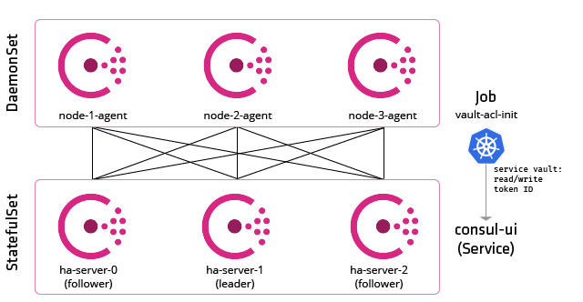
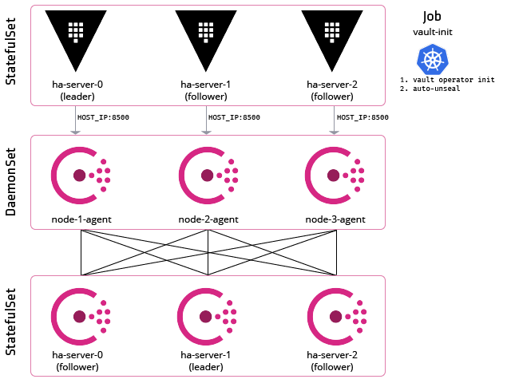

# Vault on Kubernetes

This is workshop material for deploying Vault on Kubernetes. As a pre-requisite,
this material requires a Kubernetes cluster with a proper auto-unseal mechanism.
As a result, the initial set-up of the cluster depends on Google Kubernetes
Engine. Additional Vault deployment attempts to remain agnostic of the provider,
with some exceptions.

The flow of the workshop is outlined below:

- Prepare a Kubernetes cluster of your choice.
- Deploy Consul as a backend for Vault.
- Set up self-signed certificates for Vault communication.
- Deploy Vault.
- Set up ACLs for Vault.
- Set up the [Kubernetes Vault authentication
  method](https://www.vaultproject.io/docs/auth/kubernetes.html).
- Deploy an application that retrieves the secret from Vault.

## Exceptions to Cloud Provider Agnostic Approach

1. Initial cluster creation. This uses GKE and GCP constructs.

1. Vault auto-unseal. While we do not store the unseal keys in a GCP bucket, as
   the unseal keys can be stored to the organization's discretion, for ease of
   this workshop we auto-unseal the instance using GCP KMS.

1. Kubernetes Vault authentication. This step requires the retrieval of the
   Kubernetes cluster certificate data. In GKE version 1.12+, clusters are not
   generated with a cluster certificate by default. As a result, the
   `kubeconfig` does not store cluster certificate data and uses an OAuth token
   instead. To address this concern, we call the GCP API for the cluster
   certificate.

## Why use certain tools?

This workshop material demonstrates the use of several tools in the Kubernetes
ecosystem, since its focus is running Vault on Kubernetes.

- __Helm__: We use Helm to deploy and configure Consul and Vault. While these
  can be re-templated to a Kubernetes manifest, the complexity of deploying a
  highly available Vault and Consul clusters can be fairly difficult to
  organize. Furthermore, HashiCorp supports Helm charts for Consul.

- __Consul__: There are many options for Vault backends, where the encrypted
  secrets  are stored. To remain agnostic of a specific cloud provider or
  upstream technology, we want a Kubernetes hosted backend for Vault.

## Step 0: Preparation

To start, you will need to have:

- Google Cloud Platform account
- Owner access to a project
- Google Cloud Shell, within the GCP console

From the Google Cloud Shell (or general Linux shell), you must have the
following packages installed:

- [gcloud CLI](https://cloud.google.com/sdk/install): This will already be
  installed in Google Cloud Shell.

- [helm](https://helm.sh/docs/using_helm/): This will already be installed in
  Google Cloud Shell.

- [kubectl](https://kubernetes.io/docs/tasks/tools/install-kubectl/):  This will
  already be installed in Google Cloud Shell.

First, we need the Vault CLI tool. To install in Google Cloud Shell, run:

```shell
make 0-install-vault
```

Now lets clone Github project into Google Cloud Shell workspace.

```shell
make 0-clone-project
```

Next, we'll build the cluster. We need to:

- Set up Google APIs.
- Organize a keyring and key in Google KMS, for auto-unseal.
- Build a Kubernetes cluster.
- Set up kubeconfig to point to the cluster.
- Deploy Helm (for Consul & Vault charts).

We can automate these steps via Terraform for more repeatable deployment and
management but that is out of scope for this workshop. Instead, we'll run:

```shell
make 0-build-cluster
```

## Step 1: Deploy Consul as a Vault Backend

We have the option of many [storage
backends](https://www.vaultproject.io/docs/configuration/storage/index.html) for
Vault. In this workshop, we'll use Consul to remain agnostic of a particular
cloud. Consul is a service discovery tool that includes a key-value store, which
Vault can use for storing state.

To deploy, we run:

```shell
make 1-consul
```

In summary, this command will deploy 3 Consul servers as a StatefulSet, fronted
with a service, and 3 Consul agents as DaemonSets. They are set up with Access
Control Lists to allow Vault to store configuration into Consul.



This would be very close to a production configuration, with a few additions we
might want to add later:

- Additional backup and resiliency for Consul
- TLS for cluster communication

A "production" backend should maintain the following patterns:

- Access control. This prevents anonymous or unauthorized access to the backend
  cluster

- Non-root access. We generally should not require root access to the storage
  backend.

- Resiliency. The store should quickly self-heal or be restored on failure.

__Note:__ We are using Helm for deploying Consul and Vault. The [official Helm
chart for Consul](https://github.com/hashicorp/consul-helm) can be used for
other Consul configurations, such as connect.

### Additional References

- [Consul Production
  Checklist](https://learn.hashicorp.com/consul/datacenter-deploy/production-checklist)
- [Consul ACL
  Guide](https://learn.hashicorp.com/consul/security-networking/production-acls#acl-agent-master-token)
- [Official Consul Helm Chart](https://github.com/hashicorp/consul-helm)

## Step 2: Certificates

We are using self-signed certificates. In a production environment, we might use
Let's Encrypt for a proper certificate with a certificate authority. Use of
certificates help control communication with Vault and only allow encrypted
transmission of data. It is advisable to use TLS to encrypt all traffic.

Run the following command to create certificates in the `tls/` directory.

```shell
make 2-certs
```

This will generate a self-signed certificate that allows access to the internal
Kubernetes DNS endpoints of Vault. To logically isolate our Vault deployment
from other resources, we use a Kubernetes namespace. We can apply access control
and resource quotas to the namespace.

## Step 3: Deploy Vault

Now that we've set up the backend for Vault and generated certificates, we can
deploy the Vault cluster to Kubernetes.

The Vault configuration we're deploying consists of three Vault instances. Each
of them connect to the Consul agent, with the idea that any data gets forwarded
to Consul servers. One of the Vault instances serves as the leader, while others
serve as followers.



Let's review the following files in `helm/vault-helm`.

- `server-ha-statefulset.yaml`: This contains the Vault StatefulSet that deploys
  with sticky identities for each Vault server. Vault servers reference a Consul
  agent via the underlying Kubernetes host IP and port 8500. We mount our
  certificates as volume mounts and the Consul token for connection to the
  backend as an environment variable.

- `ha-ui-service.yaml`: We use this manifest for a Vault client endpoint. This
  is generated to allow a single load-balanced endpoint for access. We add this
  to a configuration map for applications and other services to use.

- `server-ha-init-job.yaml`: We need to initialize Vault with the `vault
  operator init` command. In this deployment, we use Google KMS to facilitate
  auto-unseal. We *are not* storing the root token in a Google storage bucket.
  Instead, we scrape it from the logs and temporarily use it as a Kubernetes
  secret for additional ACL generation (next step).

__Note:__ We are storing to the root token to facilitate the workshop and *not*
storing the unseal keys. This pattern is not intended for production use. We
prefer to store the unseal keys and root keys using a sidecar into a remote key
management setup.

To deploy, run the command below.

```shell
make 3-vault
```

### Additional References

- [Vault High
  Availability](https://learn.hashicorp.com/vault/operations/ops-vault-ha-consul)

- [Vault Production
  Hardening](https://learn.hashicorp.com/vault/operations/production-hardening)

## Step 4: Deploy Vault ACLs

To restrict access to secrets, such as for a test application, we need to deploy
an access control list to specific Vault paths. We'll associate a token (or
identity) to the policy outlined by the access control list.

Let's review the following files in `helm/vault-helm-acl`:

- `acl-config.yaml`: This is the configuration we'll use to
  configure an administrator account so we do not use the Vault root token. The
  policy in this file allows the creation and modification of other policies as
  well as retrieval of secrets.

- `acl-init-job.yaml`: We use a Kubernetes Job to apply the ACL policy.

- `tests/test-runner.yaml`: This checks the administrator token for correct
  policy and revokes the Vault root token once the test passes. In a production
  setup, root tokens can be generated on-demand and should *not* be used for
  Vault interactions.

__Note:__ For this workshop, we will be adding the token as a Kubernetes secrets
since we do not have an additional store, similar to the root token.

To apply the administrator ACL, run:

```shell
make 4-acl
```

### Additional References

- [Vault Policies Guide](https://www.vaultproject.io/guides/identity/policies)
- [token revoke](https://www.vaultproject.io/docs/commands/token/revoke.html)

## Step 5: Kubernetes Auth Method

In this step, we'll enable the Kubernetes authentication method in Vault in
order to link a service account token to a Vault policy. Kubernetes uses JSON
Web Tokens (JWTs) for its service accounts. We'll enable the authentication
method and then configure Vault to talk to the Kubernetes cluster, using the
cluster's hostname, certificate, and service account JWT.

Vault uses the Kubernetes Token Reviewer API to validate the JWT.

To enable and configure the Kubernetes authenticaiton method, run:

```shell
make 5-auth
```
### Additional References

- [Kubernetes Auth
  Method](https://www.vaultproject.io/docs/auth/kubernetes.html)

## Step 6: Create ExampleApp Policy

To demonstrate how we would use a service account's JWT to access the secrets
for a given path, we'll create a policy to allow creation, deletion, updates,
and retrieval at the path `secret/data/exampleapp/*`.

Then, we link the service account to a Vault named role. After that, we'll add
a secret to `secret/data/exampleapp/config` to read later.

Apply configuration using:

```shell
make 6-policy
```

## Step 7: Deploy the Example Application

We need an application to access the static secret at
`secret/data/exampleapp/config`. The application should run with the service
account we configured and with its JWT, allow us to retrieve the secret.

Deploy the example application by running:

```shell
make 7-simple
```

## Step 8: Get the Vault Token from JWT

We will perform a Vault login on the behalf of the `exampleapp` pod and get a Vault token.
The token can be used to retreive secrets for the `exampleapp` application.

```shell
make 8-token
```

## Step 9: Get the Secret

We will now use the Vault token generated above to retreive secrets from Vault.

```shell
make 9-secret
```

### Step 10: Access Vault Secrets Using a Sidecar

The sidecar pattern is common with Kubernetes applications and can be applied to
access secrets from Vault.

Here is a diagram showcasing application secrets workflow with Vault.


An init container uses the service account JWT token in the pod and uses the
[Kubernetes auth method](https://www.vaultproject.io/docs/auth/kubernetes.html)
to authenticate with Vault. If the authentication is successful, Vault returns a
token that can be used to fetch application secrets.

Consul template then uses the Vault token to fetch appliation secrets and write
them into a shared volume so the application container can use it.

The application can read the secrets file. For this example, our application
periodically reads the config file that has secrets from the shared volume.

Deploy exampleapp sidecar application.

```bash
make 10-sidecar
```

### Step 11: Deploy MySQL on Kubernetes

In order to learn about Vault's dynamic credential generation capabilities, we will look at an example
where we generate dynamically database credentials using Vault's [Database secret engine](https://www.vaultproject.io/docs/secrets/databases/index.html).

Deploy a dummy MySQL database on Kubernetes.

```bash
make 11-mysql
```

### Step 12: Configure Vault (MySQL) Database Secrets Engine

Configure database secret engine in Vault.

```shell
make 12-database-secret-engine
```

### Step 13: Deploy Database Sidecar. (Generate Database Credentials Using a Sidecar)

Deploy dynamic secrets enabled sidecar application.

```shell
make 13-dynamic-secrets-sidecar.sh
```

## Maintainers

* [Rosemary Wang](https://github.com/joatmon08)
* [Anubhav Mishra](https://github.com/anubhavmishra)

## Credits

This tutorial is based on Seth Vargo's [Vault on GKE
workshop](https://github.com/sethvargo/vault-kubernetes-workshop).

